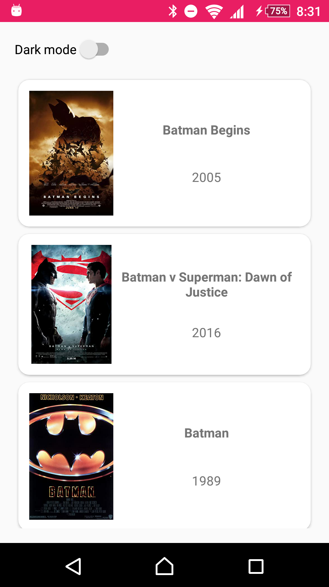
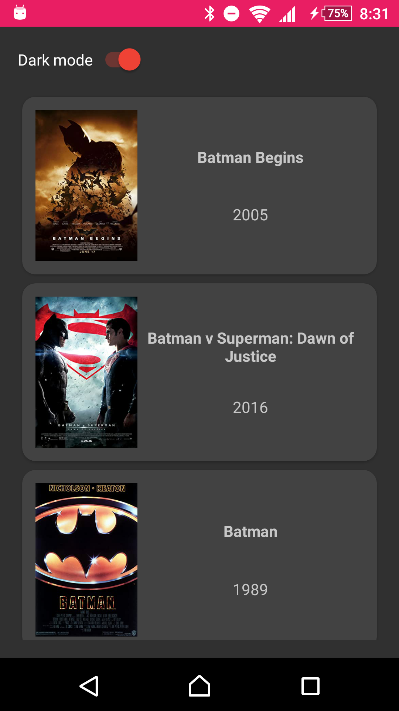

# RecyclerView with MVVM
At this time (Oct 2020), there are several code examples of Recyclerview with MVVM architecture that are not compiled or not fit right into architecture, even example code on the official Android document. In this repo, I implement a simple Recyclerview with MVVM architecture.

For watching my code explanation, please check out its playlist on youtube:
https://bit.ly/2ExLLAS

Using:
- Kotlin
- MVVM architectural pattern
- lifecycle
- LiveData
- RecyclerView
- Retrofit
- Coroutine
- Navigation
- ROOM
- WorkManager
- Dark theme
- Unit Test
- Dependency injection (Hilt)

TODO:
- Coroutine Flow

# Screenshots

  
  
  

